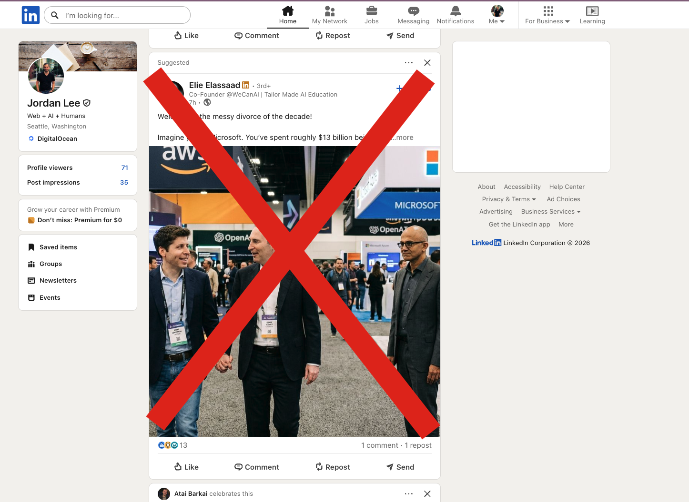

# UnLinked

They suggested, you disconnected. A Chrome extension that hides "Suggested" posts from your LinkedIn feed.

## Install

1. Download or clone this repository
2. Open `chrome://extensions` in Chrome
3. Enable **Developer mode** (toggle in the top-right corner)
4. Click **Load unpacked**
5. Select the `hide-suggested-feed-content` folder
6. Navigate to LinkedIn — suggested posts will be hidden automatically

## Usage

Click the extension icon in the Chrome toolbar to toggle hiding on or off. Your preference is saved and persists across page reloads and browser restarts.

- **Active** — suggested posts are hidden as they appear, including during scroll
- **Paused** — all hidden posts are restored and no new posts are filtered

## How it works

A content script scans the LinkedIn feed for cards labeled "Suggested" and hides them with `display: none`. A `MutationObserver` handles new cards loaded during infinite scroll. No network requests are blocked or modified — this is purely a visual filter.
